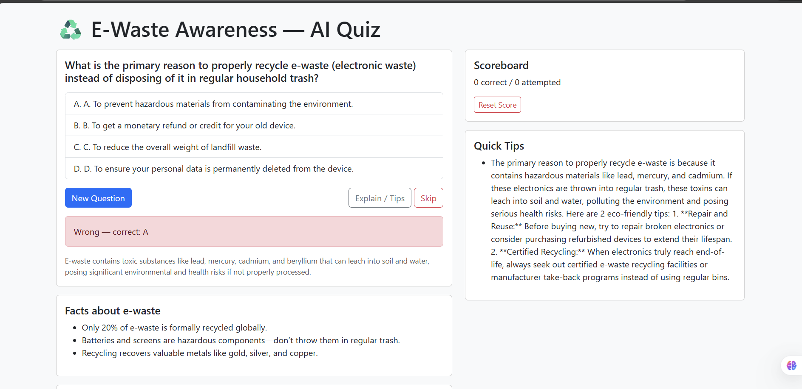

# ♻️ E-Waste Awareness — AI Quiz

A simple interactive website that teaches e-waste recycling using AI-generated quiz questions and eco-friendly tips.

## 🚀 Features
- AI-generated multiple-choice quiz questions  
- Scoreboard (correct / attempted)  
- Explanation + eco tips for every question  
- Eco-Bot chatbot to ask recycling questions  
- Clean UI built with HTML, CSS, Bootstrap  

## 🛠 Tech Used
- Frontend: HTML, CSS, JavaScript, Bootstrap  
- Backend: Node.js + Express  
- AI: Google Gemini 2.5 Flash API  

## 📁 Project Structure
